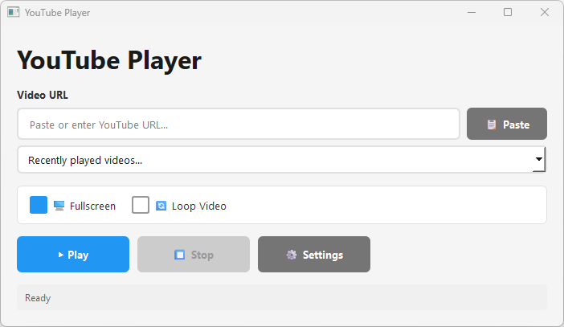

# YouTube Ad-Free Player

A modern, lightweight desktop application for playing YouTube videos without ads using MPV player and yt-dlp.

## Screenshot


## Features

- 🎬 Stream YouTube videos directly without ads
- 📋 URL history with quick access
- 🖥️ Fullscreen playback
- 🔄 Loop video option
- ⚙️ Configurable paths and settings
- 📝 Automatic logging

## Requirements

- Python 3.8+
- PyQt6
- pyperclip
- yt-dlp
- mpv (media player)

## Installation

1. Clone the repository:
```bash
git clone https://github.com/yourusername/youtube-adfree-player.git
cd youtube-adfree-player
```

2. Install Python dependencies:
```bash
python.exe -m pip install --upgrade pip
pip install PyQt6 pyperclip
```

3. Download required tools:
   - **mpv**: Download from [mpv.io](https://mpv.io/installation/)
   - **yt-dlp**: Download from [yt-dlp releases](https://github.com/yt-dlp/yt-dlp/releases)

4. Place tools in the project root directory:
```
youtube-adfree-player/
├── tools/
│   ├── mpv.exe
│   └── yt-dlp.exe
├── src/
│   └── main.py
└── logs/
```

5. Package the application (optional)**

```bash
pip install pyinstaller
pyinstaller --onefile --icon=res/icon.ico src/main.py
```


## Usage

Run the application:
```bash
python src/main.py
```

1. Paste or enter a YouTube URL
2. (Optional) Enable Fullscreen or Loop Video
3. Click **Play**

## Configuration

Access **Settings** to customize:
- MPV player path
- yt-dlp executable path
- Log directory location
- Maximum history items
- Clear history

Settings are saved to `src/config.ini`.

## Directory Structure

```
project-root/
├── tools/               # External executables
│   ├── mpv.exe
│   └── yt-dlp.exe
├── logs/                # Application logs
├── src/                 # Source code
│   ├── main.py
│   ├── config.ini
│   └── history.json
└── README.md
```

## License

MIT License - Feel free to use and modify for personal use.

## Contributing

Contributions are welcome! Feel free to submit issues and pull requests.